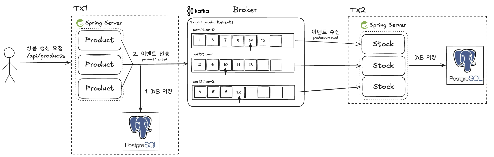

# 1주차 정리



---

## 1. DB 저장과 이벤트 발행의 원자성 부재

DB와 Kafka는 한 트랜잭션으로 묶을 수 없다.

```java
@Transactional
public Long create(...) {
    saveProductPort.save(product);       // DB
    publishEventPort.publish(event);     // Kafka - 트랜잭션 밖
}
```

저장이 롤백돼도 이벤트는 이미 나갈 수 있다. 그러면 없는 상품의 재고가 생긴다.
반대로 저장만 되고 발행이 실패하면 재고가 안 생겨서 재고 등록이 계속 404다.

## 2. 발행 성공 여부를 호출자가 알 수 없음

`send()`는 버퍼에 넣고 바로 리턴한다. 실제 전송은 별도 스레드가 하기 때문에 HTTP 응답이 나간 뒤에 성공 여부가 정해진다.

```java
@Override
public void publish(ProductCreated event) {
    String key = String.valueOf(event.productId());

    kafkaTemplate.send(Topics.PRODUCT_EVENTS, key, event)
            .whenComplete((result, ex) -> {
                if (ex != null) {
                    log.error("ProductCreated 발행 실패 productId={}, topic={}", event.productId(), Topics.PRODUCT_EVENTS, ex);
                    return;
                }

                var metadata = result.getRecordMetadata();
                log.info("ProductCreated 발행 성공 productId={}, topic={}, partition={}, offset={}",
                        event.productId(), metadata.topic(), metadata.partition(), metadata.offset());
            });
}
```

`whenComplete`로 로그는 남기지만 실패해도 자동으로 조치되는 건 없다.

## 3. 재고 생성 지연으로 인한 재고 등록 404

```
POST /api/products   -> 201
POST /api/stocks     -> 404   (이벤트 처리가 아직 안 끝남)
   ... 수백 ms ...
POST /api/stocks     -> 200
```

```java
@Override
public StockAddResult add(Long productId, int quantity) {
    Stock stock = loadStockPort.findByProductId(productId)
            .orElseThrow(() -> {
                log.warn("재고 등록 실패 - 재고 없음 productId={}, quantity={}", productId, quantity);
                return new BusinessException(ErrorCode.STOCK_NOT_FOUND);
            });

    int before = stock.getQuantity();
    stock.add(quantity);
    log.info("재고 등록 완료 productId={}, quantity: {} -> {}", productId, before, stock.getQuantity());
    return new StockAddResult(productId, quantity, stock.getQuantity());
}
```

`STOCK_NOT_FOUND`가 상품이 없어서인지, 이벤트 처리가 아직 안 끝나서인지 구분되지 않는다.
후자라면 잠시 뒤 재시도하면 되는데 클라이언트는 그걸 알 수 없어서 불편하다.
