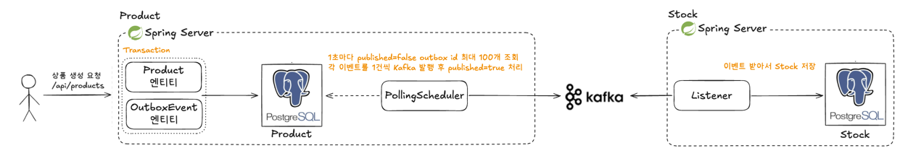

# 2주차 정리



---

## 1. 중복 발행 (at-least-once)

Kafka 전송이 성공한 뒤에 `markPublished()`를 호출한다.

```java
publishEventPort.publish(event);   // 여기서 성공한 직후 죽으면
outboxEvent.markPublished();       // 이 커밋이 반영되지 않음
```

이미 나간 이벤트가 `published = false`로 남아서 다음 폴링에 또 발행된다.
멱등성 체크가 필수

## 2. 폴링 주기만큼의 지연과 테이블 증가

발행은 poll 주기(`outbox.publisher.poll-interval-ms`, 기본 1초)만큼 늦어진다.

## 3. 상품 생성과 재고 등록이 동시에 발생 X

```
이전: 상품 저장 -> (거의 즉시) Kafka 발행 -> 컨슈머 처리
이후: 상품 저장 -> 다음 폴링까지 대기 -> Kafka 발행 -> 컨슈머 처리
```
상품등록후 바로 재고를 조회하면 404를 반환
